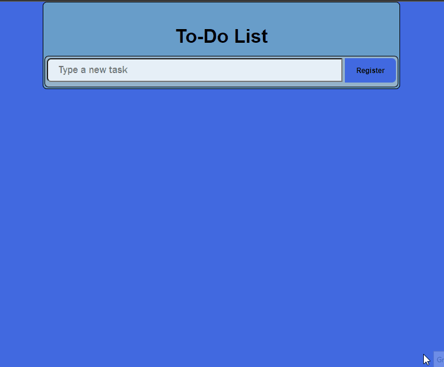
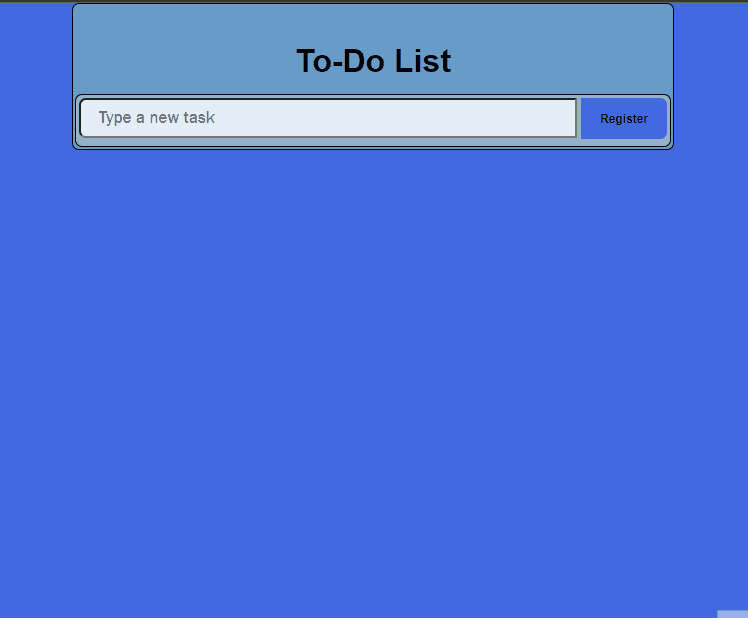
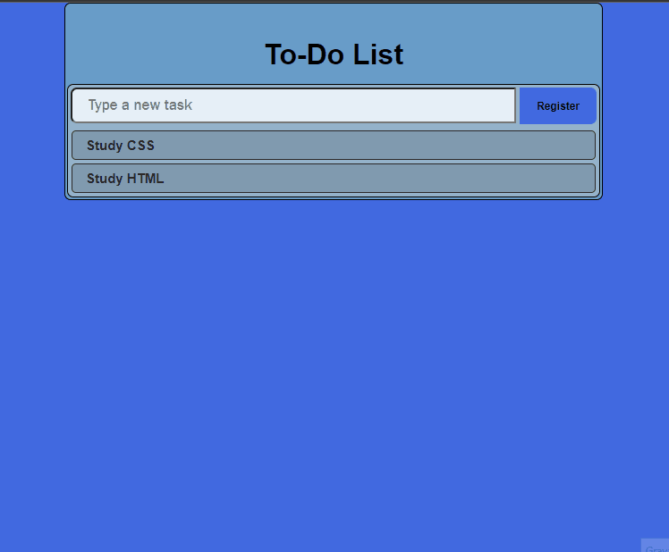
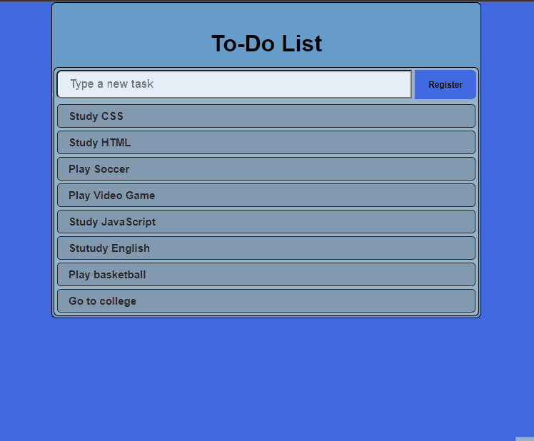
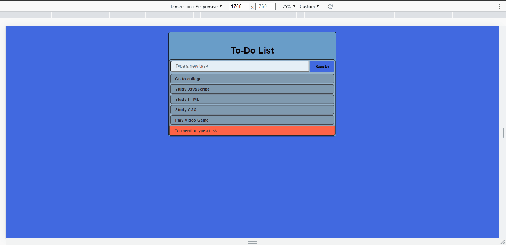

    

# To-Do List

>This is a simple _to-do list_ made with HTML, JavaScript and Bootstrap. Later migrated from bootstrap to CSS. 
---
  

# Functionalities

### Increment the to-do list

  

### Error menssage

  

### Task done (delete it)

  

### Responsiveness

 

----
  

## 👨‍💻Technologies used

✔ JavaScript

✔ HTML

✔ CSS

✔ Bootstrap

---
  

## 🚀Updates (versions)
* v1.0
    * This version is beta and very early.
      
* v1.0.0
    * In this version there was changes from portuguese to english for the project to reach more people around the world 🌎.
      
* v1.1.0
    * This is the desktop web version (no responsiveness) and without some stylizations that were made later.
      
* v1.1.1
    * This is still a desktop web version (no responsiveness), but with new CSS styles.
      
* v1.1.2
    * This is a responsive web version for desktop and mobile.
      
---
  

## Meta
**Made by:** Lucas Lopes

[Linked-in](https://www.linkedin.com/in/lucas-lopes-840965190/ "My Linked-in")

[E-mail](mailto:lucas.santos.pessoal@outlook.com "My e-mail")

 
