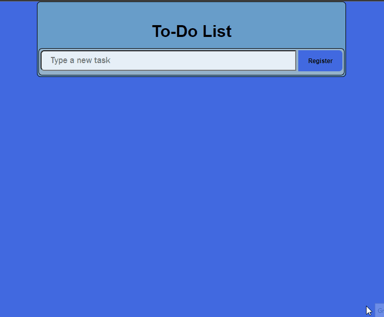
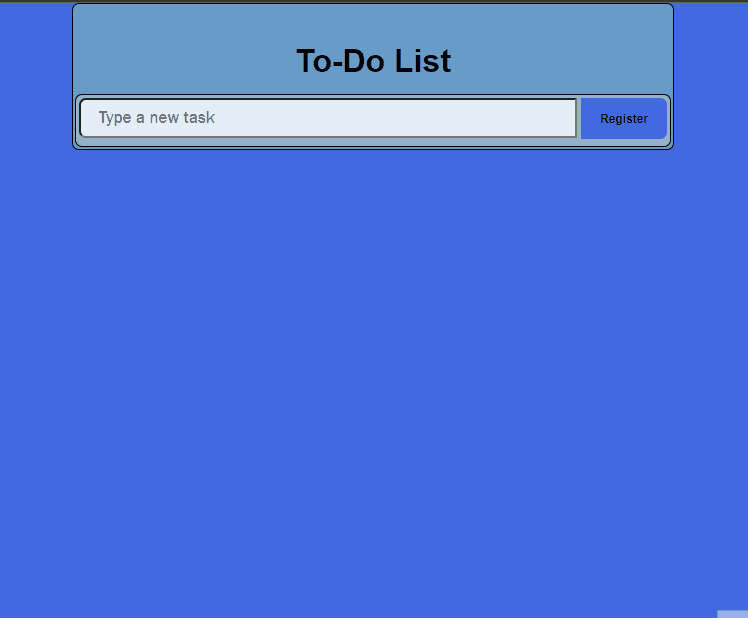
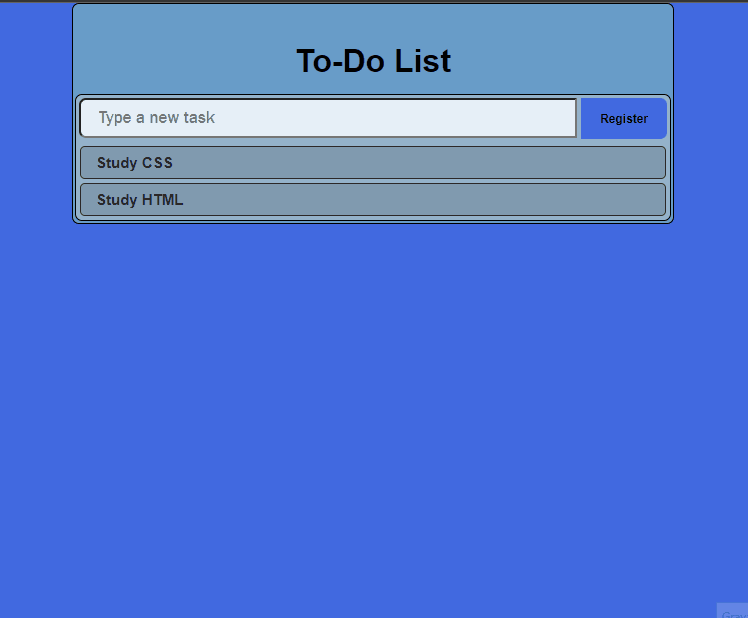
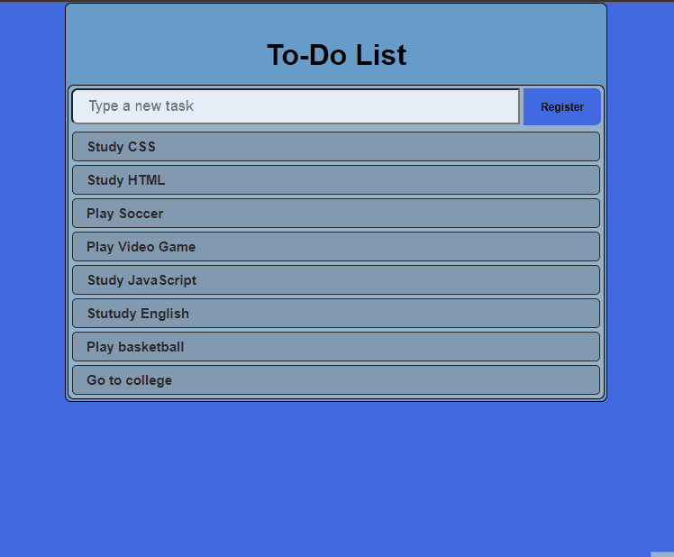

# 🚧 Under construction 🚧

# To-Do List

>This is a simple _to-do list_ made with HTML, JavaScript and Bootstrap. Later migrated from bootstrap to CSS. 

# Functionalities

### Increment the to-do list

### Error menssage

### Task done (delete it)

## Technologies used

✔ JavaScript
✔ HTML
✔ CSS
✔ Bootstrap

## Updates (versions)
* v1.0
    * This version is beta and very early.
* v1.0.0
    * In this version there was changes from portuguese to english for the project to reach more people around the world.
* v1.1.0
    * This is the desktop web version (no responsiveness) and without some stylizations that were made later.
* v1.1.
    * This is still a desktop web version (no responsiveness), but with new CSS styles.

## Meta
**Made by:** Lucas Lopes

[Linked-in](https://www.linkedin.com/in/lucas-lopes-840965190/ "My Linked-in")

[E-mail](mailto:lucas.santos.pessoal@outlook.com "My e-mail")

 